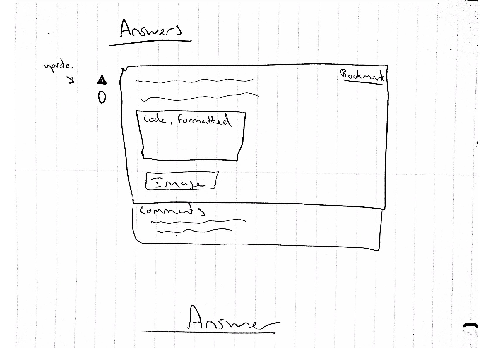

# An Open Course Discussion Platform

Our discussion platform, Veranda, in its most basic form, provides a Question & Answer interface for students, grouped by courses. Each "course" is facilitated by an "Instructor" who ultimately possesses administrative rights over the individual course.

Students can create new threads by asking a Question. Questions are automatically tagged according to their content. Once a question is posted, other students in the course can submit Answers. Each Answer is listed individually. Students can further discuss individual answers (or even the original question to ask clarification)
using the comments for said question or answer. Answers can be "upvoted" by other students. Both Questions and Answers can be flagged to notify the Instructor that his/her attention is required. Both Questions & Answers are capable of rich formatting.

In addition to the Q&A component of the platform, Instructors can post bulletins and course documents accessible to all students enrolled in the course. Students can also privately message the Instructor with questions and concerns.

Our platform essentially takes the best features of Piazza, StackOverflow, and Reddit - all platforms which have been proven to work on their own, and yet which brought together, go above and beyond a simple course discussion platform.

## Target Users

Our application is perfect for the facilitation of class discussions for high school and university students. The instructor configures a course and then provides his/her students with a private link, thus keeping the control of the discussion platform in the hands of the instructor.

## Detailed User Interactions

###  Register as an Instructor
An instructor can register on the website by clicking the "Register as an instructor" link on the homepage. The Instructor enters all the course information and clicks "Register course". After successfully registering a course, he/she would get a private registration link which can be shared with the students so that they can enroll.

### Register as a Student
A student would receive a registration link from their instructor to register for a course. The registration link would then take them to the login page.

### Student Dashboard
After logging in, the student would be taken to the overall dashboard where they can view amalgamated updates from all their courses. This dashboard has a list of bulletins for each of the courses and a list of new questions for each course. The student can then click on a question to go directly to the page for this question. A link to each course dashboard page is also available to access more specific dashboards.

### Instructor Dashboard
After logging in, the instructor would see a list of flagged questions/answers/comments that need to be moderated and a list of unanswered questions for all courses which he/she facilitates. Clicking on an individual question, would take the instructor to the question page for said question.

### Course Dashboard
Students can access the course dashboard by clicking on the course in the list of their courses (on the overall dashboard) or by clicking on a particular question. The course dashboard consists of a question page and a list of questions on the side. Students can toggle between questions by clicking on a question in the question list. At any time, the student can switch courses by clicking "Change Course" in the top navigation bar. Students can ask questions by clicking Ask Question, which would take them to the New Question page.

### Create a Question
The Create Question view contains a component for entering the question itself (a one-liner) and another component for more detail using a rich text editor (most likely Markdown based). The student can discard the new question by clicking 'Cancel' or submit the question by clicking 'Submit'. Students can edit their question by clicking the 'Edit' button next to the question (after it has been submitted).

### Answering a Question
Students and Instructors can answer questions by going to the question page and creating an answer by clicking the 'Reply' button. This would show a new component on the page that contain Rich Text functionality for entering text. The student or instructor can discard their answer at any time by clicking 'Cancel' or submit their answer by clicking 'Submit'. Students can edit their answers by clicking the 'Edit' button next to their answer.

### Adding Comments to an Answer
Students and Instructors can add comments to a particular answer by going to the Question page, and clicking 'Add Comment' below a particular answer. This would show them a textbox where they can enter a brief comment, asking for clarification or to make a point which does not warrant a full answer. They can discard their comment by clicking 'Cancel' or submit their comment by clicking 'Submit'.

### Settings
Students and Instructors can access their settings page after they are logged into the website by clicking 'Settings' in the top navigation bar. They can modify their notification settings by going to the 'notification' tab, add or remove courses by clicking 'Add/Remove course' tab, adjust security settings by clicking the 'Security' tab or change general account settings by clicking on the 'Account' tab.

### Question Page as an Instructor
On a particular question page, an instructor can endorse a question or an answer by clicking the 'Endorse' button next to it. The Instructor can remove any question or an answer by clicking 'Remove'. Instructors can mark questions as answered by clicking 'Mark as Answered' next to the question. Instructors can also pin the question by clicking the 'Pin' button next to the question. These features, and several others, make up the inline-moderator abilities of the Instructor.

## Mockups

> These extremely rough "mockups" are more so intended as a means of conveying the project (and provide visuals for the above text), rather than to be used as strict guidelines for actual implementation and design.

## Homepage (non-registered users)

## Sign up as instructor

## Sign up as student

## Login

## Instructor Dashboard

## Create a course

## Student Dashboard

## Course Dashboard

## Ask a question form

## Answers view

## Profile settings

## Inline moderation components

